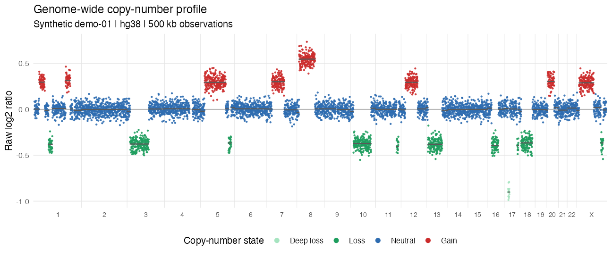
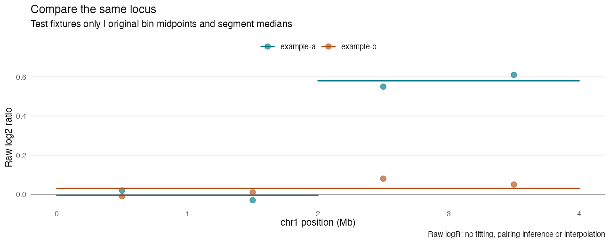
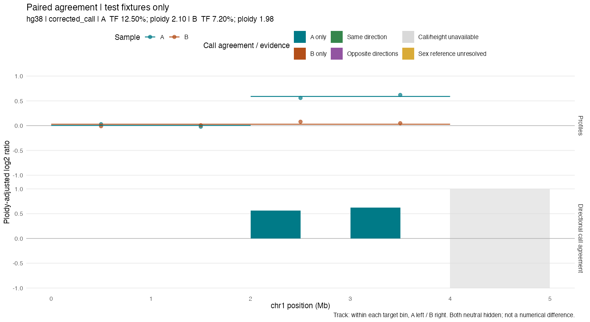
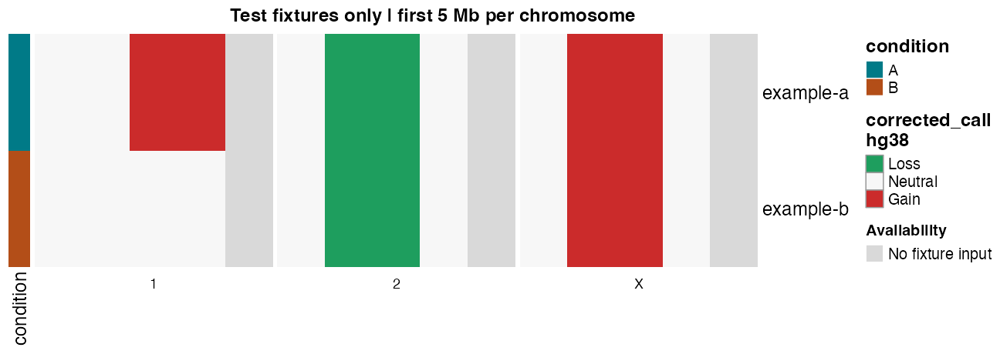

<!-- Generated from README.Rmd with make readme. Do not edit README.md directly. -->

# seeNA

**From ichorCNA output files to comparable, auditable figures in R.**

[](https://github.com/bauernhofere/seeNA/actions/workflows/R-CMD-check.yaml?query=branch%3Amain)

seeNA reads existing [ichorCNA](https://github.com/GavinHaLab/ichorCNA)
results and turns them into plots: single genome-wide profiles, overlays of
related samples, zoomed regions, and annotated cohort heatmaps. It does not
run ichorCNA, choose a fitted solution, infer sample pairing, or call
copy-number alterations. Original calls, missing values and input fingerprints
stay with the plots.

| View | What you get |
|---|---|
| **Sample** | Genome-wide logR, call-colored bins, segment medians and fitted parameters |
| **Comparison** | Shared genomic coordinates for paired or longitudinal samples you select |
| **Region** | Any `chr:start-end` interval, without rebinning the source points |
| **Cohort** | Coverage-aware matrices and annotated ComplexHeatmap objects |
| **Your style** | Ordinary ggplot objects, named palettes and public transformation helpers |

> **Public development version.** No tagged or archived release yet; APIs may
> change. See the [decision register](docs/decision-register.md) for rationale
> and open scientific approval gates.

## Install


``` r
# install.packages("remotes")
remotes::install_github("bauernhofere/seeNA", ref = "main")
# Record the exact commit you installed alongside your results:
packageDescription("seeNA")$RemoteSha

# Optional heatmap dependencies:
# install.packages("BiocManager")
BiocManager::install(c("ComplexHeatmap", "circlize"))
# install.packages("ragg")  # optional headless rasterization
```

## Quick start: one sample

Supply the genome build and the files from one selected ichorCNA run. Only the
bin file is required; the segment and parameter files add segment medians and
tumor fraction / ploidy.


``` r
library(seeNA)
root <- system.file("extdata", package = "seeNA")
a <- read_ichor_sample(
  file.path(root, "example-a.cna.seg"),
  file.path(root, "example-a.seg"),
  file.path(root, "example-a.params.txt"),
  genome_build = "hg38"
)
a
#> <ichor_sample> example-a
#>   genome: hg38
#>   bins: 12
#>   TF: 0.125
```

All pictures below use only the two bundled test fixtures: twelve hand-written
bins on chromosomes 1, 2 and X, not patient data or fitted ichorCNA output.
Blank genomic space is real absence, not filled in.


``` r
plot_ichor_profile(a, point_size = 1.8) +
  ggplot2::labs(
    title = "A profile on reference-length axes",
    subtitle = "Test fixture only | 12 bins on chromosomes 1, 2 and X",
    caption = "Empty space = no fixture observations; raw segments are grey"
  ) +
  ggplot2::theme(
    panel.grid.major = ggplot2::element_blank(),
    axis.text.x = ggplot2::element_text(size = 8),
    plot.title = ggplot2::element_text(face = "bold", color = "#183B4E"),
    legend.position = "bottom"
  )
```



Plot functions return ordinary **ggplot objects**: add themes, labels or view
limits, or export with `ggplot2::ggsave()`. Named `colors` arguments change
the palette, not the calls. Every plot shows the sample identifier by default;
pass `show_sample_id = FALSE` (or `show_row_names = FALSE` for heatmaps) to
omit it.

## Compare samples and zoom into a locus


``` r
b <- read_ichor_sample(
  file.path(root, "example-b.cna.seg"),
  file.path(root, "example-b.seg"),
  file.path(root, "example-b.params.txt"),
  genome_build = "hg38"
)
plot_ichor_region(
  list(a, b), "chr1:1-4000000", point_size = 2.5,
  colors = c("example-a" = "#007A87", "example-b" = "#B34E18")
) + ggplot2::labs(
  title = "Compare the same locus",
  subtitle = "Test fixtures only | original bin midpoints and segment medians",
  caption = "Raw logR; no fitting, pairing inference or interpolation"
)
```



Use `plot_ichor_compare(list(a, b))` for a genome-wide overlay. You decide
which samples belong together; the package does not infer pairs from filenames.

## Paired call-agreement track

Compare an explicitly supplied pair on a coverage-aware grid. The upper panel
keeps original profile points; the lower panel labels one-sided alterations,
same-direction alterations and opposite directions. Missing or mixed calls stay
unknown. This is **call agreement**, not the numerical difference between fluids.


``` r
plot_ichor_concordance(
  a, b, region = "chr1:1-5000000", ploidy_adjust = TRUE, ylim = c(-1, 1),
  sample_labels = c("A", "B"), point_size = 2, show_sample_id = FALSE
) + ggplot2::labs(title = "Paired agreement | test fixtures only")
```



Within each target bin, A is shown on the left and B on the right; one-sided
categories show only the altered sample. `height = "representative"` instead
uses the manuscript's mean/largest-absolute-height rule (ties choose A). Neither
height rule reassigns calls based on logR sign. `ylim` is shared by both panels;
out-of-view heights warn instead of silently changing the input.

Adjust panel proportions and mark widths without changing the measurements:


``` r
plot_ichor_concordance(
  a, b, ploidy_adjust = TRUE,
  panel_heights = c(2, 1.1), segment_linewidth = 0.32, point_stroke = 0
) + ggplot2::theme(legend.position = "bottom")
```

`panel_heights` orders the profile and agreement panels; `height` selects the
bar-value policy. Unequal panel proportions require ggplot2 >= 4.0.0; ggplot2 3.5
supports equal panels and all other options. Unsupported proportions fail clearly,
rather than silently changing the layout. Styling keeps the same measurements.
One-sided track colors follow `sample_colors` unless you supply an explicit
agreement `colors` palette. The tighter y limits above are for the sparse demo;
the function default remains -2 to 2.


``` r
agreement <- ichor_pair_concordance(a, b, chromosomes = "1")
agreement[1:5, c("start", "call_a", "call_b", "concordance")]
#>     start  call_a  call_b  concordance
#> 1       1 Neutral Neutral both_neutral
#> 2 1000001 Neutral Neutral both_neutral
#> 3 2000001    Gain Neutral       a_only
#> 4 3000001    Gain Neutral       a_only
#> 5 4000001    <NA>    <NA>      unknown
```

On X/Y, missing or ambiguous NEUT-bin reference evidence is flagged in gold,
not taken as proof that source calls are wrong. For an explicitly conservative
view, use `sex_chromosomes = "require_neutral"` to make those comparisons unknown.
No diploid or autosomal reference is substituted. See D19–D20 in the
[decision register](docs/decision-register.md).

## Cohort heatmap

Read a manifest (CSV/TSV or data frame with `sample_id`, `cna_seg` and
optional `seg`, `params` and annotation columns), then build a matrix of one
explicit measurement. Here `value = "call"` shows corrected call categories.


``` r
cohort <- read_ichor_cohort(
  file.path(root, "example-manifest.csv"), genome_build = "hg38"
)
m <- ichor_matrix(cohort, value = "call", chromosomes = c("1", "2", "X"))
m
#> <ichor_matrix>
#>   2 samples x 649 bins
#>   value: call
#>   bin size: 1e+06 bp
#>   minimum coverage: 1
```

For this tiny illustration, keep only the first 5 Mb of each chromosome. The
fifth bin has no fixture input and stays NA. Subset the coordinates and all
three aligned layers together.


``` r
keep <- m$bins$start <= 5e6
view <- m
view$bins <- m$bins[keep, , drop = FALSE]
for (layer in c("values", "coverage", "mixed")) {
  view[[layer]] <- m[[layer]][, keep, drop = FALSE]
}
validate_ichor_matrix(view)
```


``` r
h <- plot_ichor_heatmap(
  view, annotation_columns = "condition",
  annotation_colors = list(condition = c(A = "#007A87", B = "#B34E18"))
)
missing_key <- ComplexHeatmap::Legend(
  title = "Availability", labels = "No fixture input",
  legend_gp = grid::gpar(fill = "#D9D9D9", col = NA)
)
ComplexHeatmap::draw(
  h, heatmap_legend_list = list(missing_key),
  column_title = "Test fixtures only | first 5 Mb per chromosome",
  column_title_gp = grid::gpar(fontsize = 12, fontface = "bold")
)
```



For a full cohort, plot `m` directly. Rows keep manifest order unless you ask
for another order. Check `m$coverage` and `m$mixed` before interpreting NA
cells: ichorCNA filters bins, and an absent bin is not a neutral call.

For a continuous, segmented signal instead of discrete calls, use the exported
segment medians. Every sample needs a segment file from its selected run.


``` r
segmented <- ichor_matrix(
  cohort, value = "segment_median", chromosomes = c("1", "2", "X")
)
segmented$values[, 1:4]
#>           chr1:1-1e+06 chr1:1000001-2e+06 chr1:2000001-3e+06 chr1:3000001-4e+06
#> example-a       -0.005             -0.005               0.58               0.58
#> example-b        0.030              0.030               0.03               0.03
segment_heatmap <- plot_ichor_heatmap(
  segmented,
  colors = circlize::colorRamp2(c(-1, 0, 1), c("#1E9E5E", "#F7F7F7", "#CB2B2B"))
)
# ComplexHeatmap::draw(segment_heatmap) renders it on the current device.
```

These are raw log2-ratio segment summaries, not tumor copy numbers or new calls.
At segment boundaries, target bins contain overlap-weighted means of exported
medians. Coverage measures finite **segment spans**, which can bridge missing
source bins; NA medians and gaps between segments stay unsupported. Source bin
logR is unchanged. TF affects amplitude, so weaker signal does not establish
biological absence. The shared ±1 color limits above are illustrative saturation
limits, not CNA thresholds. See decision D22 for the interpretation limits.

## Raw or ploidy-adjusted logR

Raw logR is the default. `ploidy_adjust = TRUE` adds
`log2((TF * ploidy + (1 - TF) * 2) / 2)` to both bins and segment medians,
reproducing the upstream plotting shift from the exported parameters. It is a
display transform, not a purity correction or a new call.


``` r
plot_ichor_profile(a, ploidy_adjust = TRUE)
plot_ichor_region(list(a, b), "chrX:1-4000000", ploidy_adjust = TRUE)

ichor_tf(a)                         # fitted fraction, not percent
ichor_ploidy(a)                     # fitted tumor ploidy
ichor_adjusted_logr(a)              # adjusted bins in input order
ichor_adjusted_logr(a, "segments")  # same shift for segment medians
ichor_neutral_cn(a)                 # CN observed in NEUT bins, with status
ichor_genome_layout("hg38")         # reference lengths, offsets and midpoints
ichor_call_state(c("NEUT", "AMP"))  # mapping used by ichor_state_colors()
```

## Defaults you can audit

| Decision | Why / important limit |
|---|---|
| Explicit genome build and selected run | Matching source IDs does not prove run or assembly identity |
| `bounds = "window"` | Only source-grid-supported terminal padding is clipped and recorded; strict `"error"` and broader opt-in `"trim"` are available |
| Missing stays missing | Unknown tokens fail instead of becoming neutral/false |
| Explicit matrix `value` | Raw events, corrected calls, CN and logR are different measurements |
| Full observed target coverage by default | Lower coverage requires an explicit choice; zero support always stays NA |
| BP-weighted means for continuous values; BP modes for calls | Category ties are NA, mixtures flagged; fractional mean CN is not an integer call |
| Manifest order, no default clustering | Optional clustering is exploratory and excludes bins not observed in every row |
| Identifiers shown, opt-out per plot | Aliases are your choice; hide them with `show_sample_id` / `show_row_names` |
| Import-time fingerprints; paths opt-in | Reproducibility metadata, not de-identification or a security guarantee |

The [decision register](docs/decision-register.md) separates upstream
contracts, package policies and study choices needing approval. The
[installed methods](inst/methods.md) specify the exact transformations, and
the [workflow vignette](vignettes/manuscript-workflow.Rmd) includes an
auditable run-selection recipe.

## Reproducibility and development


``` r
ichor_provenance(cohort)
sessionInfo()
# Save these privately with the selected-run manifest, package commit,
# assembly, coordinate changes, matrix settings and plotting options.
```

```bash
make bootstrap  # development dependencies; network required
make readme     # execute this README and regenerate its fixture-only pictures
make test
make check
```

The CI badge above reports the current status of `R CMD check` on five
platforms; run `make check` locally for the same result. See
[validation evidence and limits](docs/downstream-validation.md). Passing
checks do not establish biological validity or approve study figures.

Real inputs and figures stay outside this repository. Final run selection,
exclusions, thresholds and presentation still need author approval; see the
[remaining integration gaps](docs/decision-register.md#live-manuscript-port-audit).

## Credit and citation

seeNA is independent and unofficial; it is distributed under **GPL-3-or-later**.
See [NOTICE.md](NOTICE.md) for attribution and upstream provenance. Cite
[Adalsteinsson, Ha, Freeman et al. (2017)](https://doi.org/10.1038/s41467-017-00965-y)
for ichorCNA, and record the exact seeNA commit used. A tagged release and
final citation metadata await author approval.
